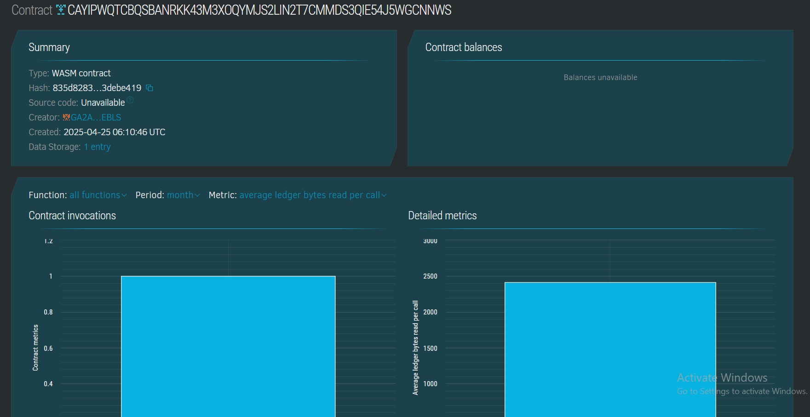

# Virtual Wardrobe for Outfit Planning

## 📌 Project Title
**Virtual Wardrobe for Outfit Planning**

## 📋 Project Description
This project introduces a decentralized wardrobe management system using blockchain smart contracts. Users can store and manage their clothing items securely on-chain, allowing them to plan outfits digitally and track wardrobe inventory.

## 🎯 Project Vision
The goal is to empower users with a virtual wardrobe platform where they can:
- Digitally manage clothing items
- Plan outfits for events
- Maintain a historical log of worn outfits
- Enable AI outfit suggestions in future iterations

## ✨ Key Features
- Add clothing items by category (e.g., Tops, Bottoms, Shoes)
- View individual clothing item details
- Keep track of total wardrobe items
- All data stored securely using Soroban smart contracts

## 🚀 Future Scope
- Integration with AI for outfit suggestions
- Event-based outfit planning (e.g., weddings, interviews)
- Social sharing of favorite outfits
- Support for images and external links to outfits
- User-specific wardrobe isolation using identity/addressing

